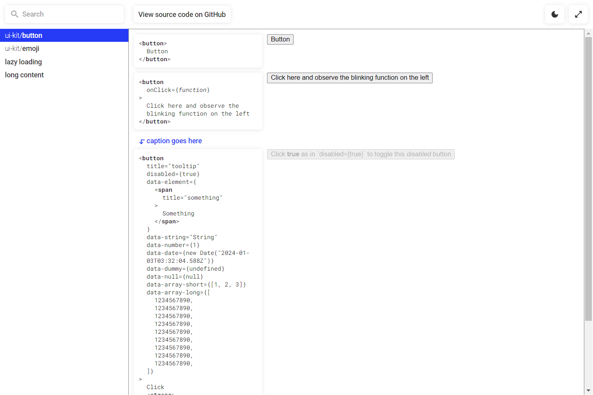

**Playbook** is a UI library made for listing React components.



- Compatible with any web bundler since this is just a small React UI library.
- Extensible using `contentWrapper` and `contentControl` props.
- When wrapping your component in `<Catalog>`, this enables:
	- Prop-introspection.
	- Prop-editing for top-level string, number, Boolean and Date props.
	- Blinking callbacks when being called.
- See the live demo at https://thisismanta.github.io/react-playbook/
- See the usage example at [src/demo/index.tsx](./src/demo/index.tsx)
- See how to integrate this with [Vite](https://vitejs.dev/) at [vite.config.mts](./vite.config.mts)

## Basic usage
```tsx
import { Playbook } from '@thisismanta/react-playbook'

<Playbook
  pages={[
    {
      name: 'your component name',
      content: () => <div>Content goes here</div>
    },
    ...
  ]}
  contentWrapper={...}
  contentControl={...}
/>

// Use the below in `contentControl` for visual consistency
<Playbook.Button onClick={...}>
  Playbook-style button
</Playbook.Button>
```

## Enabling prop-introspection
```tsx
import { Catalog } from '@thisismanta/react-playbook'

<Catalog><YourComponent/></Catalog>

// Pass down React CSS properties to each of your component
<Catalog style={...}><YourComponent/></Catalog>

// List your components in left-to-right direction
<Catalog.Grid><YourComponent/></Catalog.Grid>
```

## Controlling viewing component state from the top bar
```tsx
import { usePlaybookState, setPlaybookState, IPlaybookPage } from '@thisismanta/react-playbook'

const StateName = 'name'

function YourComponent() {
  const value = usePlaybookState(StateName, false)
  return (
    <button disabled={value}>
      Button
    </button>
  )
}

function ContentControl(props: { currentPage?: IPlaybookPage }) {
  return (
    <button onClick={() => { setPlaybookState(StateName, true) }}>
      Disable {props.currentPage?.name}
    </button>
  )
}

<Playbook
  pages={[{ name: 'Button', content: YourComponent }]}
  contentControl={ContentControl}
/>
```
